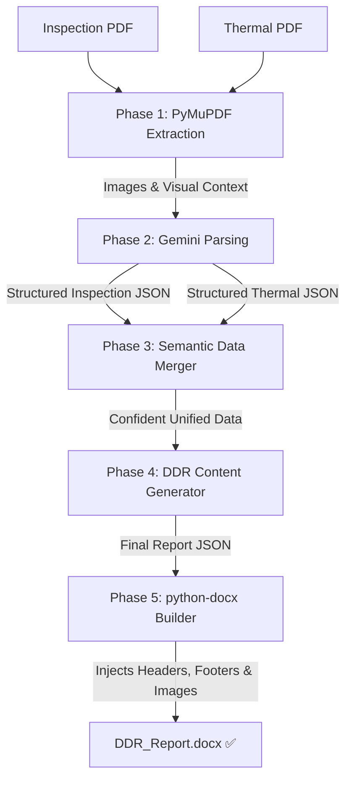

# Applied AI Builder: Automated DDR Report Generation

**A production-grade AI pipeline that intelligently converts fragmented Site Inspection and Thermal PDF reports into a single, cohesive Microsoft Word Document (Detailed Diagnostic Report).**

This project was built to explicitly satisfy the requirements of the *AI Generalist | Applied AI Builder* practical assignment. It focuses heavily on **system reliability, accurate data merging, robust error handling, and high-fidelity document generation.**

---

## 🎯 How the Assessment Criteria Were Met

| Criteria | How it was solved |
| :--- | :--- |
| **Combine information logically** | Built `data_merger.py` to semantically evaluate and merge text based on overlapping spatial concepts, handling cases where the Thermal and Inspection reports label the same room slightly differently. |
| **Avoid duplicate points** | Deduplication is forced at the merge layer. The AI outputs a confidence score for overlapping issues and consolidates identical root causes into single, high-fidelity entries. |
| **Handle missing/conflicting details** | Hardcoded strict systemic prompts. If data is absent, the system explicitly writes `"Not Available"`. If findings conflict (e.g., visual says dry, thermal shows severe leak), the AI highlights the exact conflict in the *Missing or Unclear Information* section. |
| **Image Extraction & Placement** | Leveraged `PyMuPDF` to programmatically extract raw image objects from the PDFs. Implemented strict `300x300` dimension filtering to automatically detect and discard irrelevant `UrbanRoof` logos/icons. Images are then structurally paired directly under their relevant textual observations natively in Word. |
| **System Thinking & Reliability** | Built an **Asynchronous Checkpoint Pipeline**. Because free-tier LLMs suffer from rate limits and network drops, the application saves `.json` states after every phase. If the process is halted, it resumes instantly from the exact phase it failed at, saving time and API quotas. |

---

## 🧠 System Architecture

The pipeline does not use a single monolithic AI prompt. Instead, it breaks the extraction down into **5 distinct phases**, mimicking human reasoning:



### Key Engineering Decisions
1. **Model Choice (Gemini 2.5 Flash)**: Chosen for its native multi-modal capabilities. Instead of relying purely on OCR text extraction (which breaks on weird PDF layouts), the system converts PDF pages to high-res `PNGs` and feeds them directly to Gemini Vision to understand spatial layout, tables, and handwritten notes.
2. **Native Microsoft Word (`.docx`)** over HTML/PDF: Clients need editable reports. Generated reports natively inject branded headers, dynamic footers (with page numbers), and 2-column image tables using `python-docx`'s low-level XML manipulation. No messy HTML conversion or risky string-replacement templates were used.
3. **Advanced Rate-Limit Handling**: `gemini_client.py` uses exponential backoff. If the pipeline encounters a HTTP 429 Too Many Requests, it automatically sleeps and retries rather than crashing the pipeline.

---

## 🚀 Setup & Deployment

### 1. Installation
Ensure you have Python 3.10+ installed.
```bash
git clone https://github.com/YOUR_USERNAME/ddr-generator.git
cd ddr-generator
python -m venv .venv
source .venv/bin/activate  # On Windows use: .venv\Scripts\activate
pip install -r requirements.txt
```

### 2. Configuration
Duplicate the example environment file:
```bash
cp .env.example .env
```
Open `.env` and paste your free Google Gemini API Key:
```env
GEMINI_API_KEY="your_api_key_here"
GEMINI_MODEL="gemini-2.5-flash"
```

### 3. Run the Web Interface (Recommended)
This kicks off the Streamlit frontend. It includes a dynamic progress bar, file uploaders, and protects against OS file locks.
```bash
streamlit run app.py
```
Open `http://localhost:8501`. Upload your two source PDFs, click "Force fresh run", and generate the document.

### Command Line Alternative
```bash
python main.py --inspection "input/Sample Report.pdf" --thermal "input/Thermal Images.pdf" --output "output/DDR_Report.docx"
```

---

## ⚠️ Limitations & Future Improvements

To answer the prompt criteria for continuous improvement:
1. **Scaling past Cloud Quotas**: Currently, passing 40 high-res page images requires extensive LLM input tokens. While Gemini Flash is fast, large building batches can cause Free-Tier Rate Limits. 
   - *Improvement*: Switch to asynchronous batched generation requests, or pre-filter pages using a lightweight classifier to completely skip PDF cover pages, tables of contents, and blank separator pages.
2. **Dense Tabular OCR Fallback**: If a PDF is a highly compressed scan, Native Vision struggles to read dense sensor tables.
   - *Improvement*: Integrate `PaddleOCR` or `pytesseract` to extract hard tabular data first, passing it as a text string alongside the image to ground the LLM.
3. **Automated Defect Flagging**: Currently, the AI relies on the human inspector's written notes.
   - *Improvement*: Train a tiny YOLOv8 vision model or most reccently launched IBM's Dockling to explicitly detect severe heat anomalies in the raw thermal images, overriding the text report if the human inspector missed a critical hotspot.
